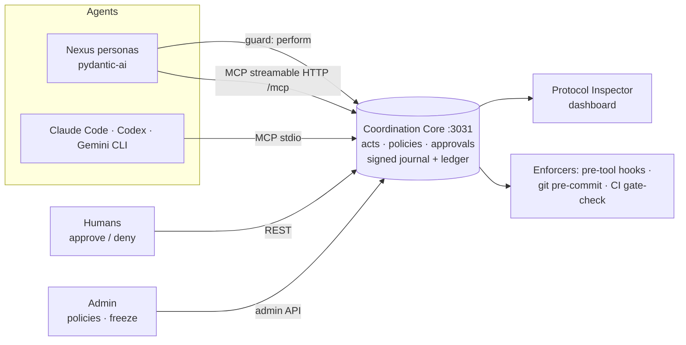

# NeuralOps

**The rulebook and the record underneath a human + AI workspace.**

When AI agents do real work (write to an ERP, send email, edit a repo, deploy), someone has to decide what they are allowed to do, a person has to be able to say "not without me", and afterwards everyone needs a trustworthy record of what happened. NeuralOps is that layer. Agents connect over [MCP](https://modelcontextprotocol.io); humans approve; every step is written to a signed, replayable ledger.

It was built for [NeuralOps Nexus](https://github.com/mapax-io/neuralops-nexus), a human + AI workspace, and works just as well for coding agents (Claude Code, Codex CLI, Gemini CLI).

[](LICENSE) · V0.1.5 · 148 automated tests · Bun + TypeScript

> **Evaluating it for Nexus?** Start with the [proposal & test guide](docs/PITCH.md), then the [Nexus setup guide](mini-services/neuralops-mcp/integrations/nexus/README.md).

---

## Contents

- [What it does](#what-it-does)
- [How it works](#how-it-works)
- [Quick start (5 minutes, local demo)](#quick-start-5-minutes-local-demo)
- [Use it with NeuralOps Nexus](#use-it-with-neuralops-nexus)
- [Use it with coding agents](#use-it-with-coding-agents)
- [Core concepts](#core-concepts)
- [API at a glance](#api-at-a-glance)
- [Configuration](#configuration)
- [Security model](#security-model)
- [Repository layout](#repository-layout)
- [Development and tests](#development-and-tests)
- [Status, limits and roadmap](#status-limits-and-roadmap)
- [Contributing](#contributing)

## What it does

| | |
|---|---|
| **Gated actions** | Before an agent runs a tool that touches a real system, it calls `perform`. The answer is *allowed* (direct authority, or no policy covers it), *wait* (a named human must approve; approvals are single-use and never self-approved), or *frozen*. |
| **Kill switch** | One admin call freezes every agent, persona, gate and hook until someone unfreezes it. |
| **Setup in one call** | Policy presets (`nexus-default`, `solo-dev`, `two-agent-team`, `production-gated`, `lockdown`) set a sensible rulebook with the approver you name. |
| **People in the loop** | A webhook tells Nexus, Slack or a pager when an approval is waiting, when it is decided (with the approver's reason), and when the workspace is frozen. |
| **Auditors** | Read-only audit identities can read the ledger and the integrity proof, and nothing else; they can never act. |
| **Coordination** | Tasks, claims, handoffs, decisions, evidence, questions and proposals as **26 typed acts**, plus a compact task context so the next agent doesn't need the whole history. |
| **File reservations** | Agents reserve files or globs; others can't edit (pre-tool hooks) or commit (git pre-commit) what someone else holds. |
| **Merge and deploy gates** | Tasks can require approval, and even VERIFIED evidence (recorded by CI, not claimed by the agent), before they may complete, merge or deploy. |
| **Proof** | HMAC-signed journal + hash-chained ledger; restart replays into the identical state; `/api/integrity` proves it. Tampering stops the server from starting. |
| **Enforcement outside the model** | Python guard for pydantic-ai agents (Nexus), pre-tool hooks for Claude Code / Codex CLI / Gemini CLI, a git pre-commit hook, and a GitHub required check. An agent cannot talk its way past a rule. |

## How it works



- **One core owns the truth.** A single Bun process holds the state, validates every act against a zod schema, applies it atomically (a rejected act changes nothing), appends a ledger event and journals it.
- **Everything else asks the core.** Hooks, the guard and CI call `perform` or `/api/gate/status` and obey the answer; they hold no rules of their own.
- **The journal is the source of truth.** State is rebuilt from it on boot; the ledger's hash chain and the journal's HMAC chain make edits visible.

## Quick start (5 minutes, local demo)

Requires [Bun](https://bun.sh) ≥ 1.1. For the dashboard also [Caddy](https://caddyserver.com/download). Python 3 is only needed for the guard's tests.

```bash
git clone https://github.com/z-sops/neuralops.git
cd neuralops/mini-services/neuralops-mcp
bun install
bun test                 # 148 pass
bun run dev              # core on 127.0.0.1:3031 (demo mode, seeded workspace)
```

Try it from another terminal:

```bash
curl -s localhost:3031/api/health
curl -s localhost:3031/api/integrity          # chainValid + replayMatches
curl -s -X POST localhost:3031/api/tools/neuralops_inbox -H 'X-Agent-Id: agent.backend' -H 'Content-Type: application/json' -d '{}'
```

Dashboard (optional), two more terminals from the repo root:

```bash
bun install && bun run dev:local                 # Next.js on 127.0.0.1:3000
caddy run --config Caddyfile                     # gateway on :81  (Windows: .\caddy.exe run --config Caddyfile)
```

Open **http://localhost:81** (not `:3000`: the dashboard reaches the core through the gateway). The Coordination Console walks through the demo scenarios; the ones that are supposed to fail (an agent authorizing its own approval, QA reserving files Backend holds) do.

Demo mode seeds six agents with public tokens (`nops_demo_backend`, `nops_demo_architect`, …) and only listens on loopback. Use secure mode for anything else.

## Use it with NeuralOps Nexus

Full guide: [`integrations/nexus/README.md`](mini-services/neuralops-mcp/integrations/nexus/README.md). In short:

1. **Run the core in secure mode on the host IP.** Nexus' `nexus-ai` container can't reach `localhost`.
   ```bash
   NEURALOPS_MODE=secure NEURALOPS_HOST=0.0.0.0 \
   NEURALOPS_ADMIN_TOKEN=$(openssl rand -hex 24) NEURALOPS_JOURNAL_KEY=$(openssl rand -hex 32) \
   bun mini-services/neuralops-mcp/src/index.ts
   ```
2. **Register people and personas** (`POST /api/agents`, admin token; each gets its own token) and **set the rulebook** in one call: `POST /api/presets/nexus-default/apply {"approver":"agent.noaman"}` (or add policies one by one, e.g. `odoo.write/production → agent.noaman`).
   Set `NEURALOPS_WEBHOOK_URL` so Nexus hears about approvals the moment they are needed.
3. **Gate tool calls in `nexus-ai`** with the Python guard (standard library only):
   ```python
   from neuralops_guard import NeuralOpsGuard
   guard = NeuralOpsGuard(url="http://<host-ip>:3031", token=persona_token,
                          actions={"create_invoice": "odoo.write"})
   toolset = MCPToolset(client, process_tool_call=guard.process_tool_call)
   ```
   A blocked call doesn't run; the model is told which approval is pending and with whom.
4. **Optionally** register NeuralOps itself as an MCP server in Nexus: `http://<host-ip>:3031/mcp`, streamable-http, `Authorization: Bearer <persona token>`.

## Use it with coding agents

Connect an agent over MCP stdio (one token per agent):

```bash
claude mcp add neuralops \
  -e NEURALOPS_URL=http://127.0.0.1:3031 -e NEURALOPS_TOKEN=<agent token> \
  -- bun /abs/path/to/neuralops/mini-services/neuralops-mcp/src/mcp/stdio.ts
```

Then add enforcement that the model can't skip (all paths under `mini-services/neuralops-mcp/`):

| Where | What it blocks | Setup |
|---|---|---|
| Claude Code `PreToolUse` hook | edits without a claimed task or on files another agent reserved; push to `main` before clearance; deploys without approval; everything while frozen | `integrations/claude-code/settings.example.json` |
| Codex CLI `PreToolUse` hook | same rules; every file inside an `apply_patch` is checked | `integrations/codex/config.toml` |
| Gemini CLI `BeforeTool` hook | same rules for `write_file`, `replace`, `run_shell_command` | `integrations/gemini/settings.json` |
| git pre-commit (any agent or human) | commits touching files someone else reserved | `bun run install-git-hook -- --repo <worktree> --token <token>` |
| GitHub required check | merging until the task is completed and cleared | `integrations/github/neuralops-gate.yml` |

Local hooks can be removed and `git commit --no-verify` skips git hooks, so the CI check is the final line.

## Core concepts

**Identities.** Every agent, persona and approving person is an identity (`agent.<name>`) with a role, a manager (`reportsTo`), direct authority grants and bearer tokens (stored as SHA-256; expiry, revoke, rotate).

**Acts.** Everything that changes state is one of 26 typed acts in 6 families:

| Family | Acts |
|---|---|
| task | `create_task` `claim` `release` `complete` `block` `status` `reserve_files` `release_files` |
| handoff | `handoff` `accept_handoff` `reject_handoff` |
| information | `evidence` `decision` `update` |
| conversation | `question` `answer` `proposal` `counter` (expire after a TTL) |
| authority | `request_approval` `authorize` `deny` `escalate` `perform` |
| lifecycle | `subscribe` `unsubscribe` `ack` |

**Authority.** Direct grants (`deploy/production`, wildcards allowed) let an identity act at once. **Policies** (`action/scope → approver`) say who must approve everyone else; without a policy the requester's manager approves. Anyone above the approver can approve; an identity with `deny/<scope>` can veto; nobody approves their own request. Approvals are single-use and bound to the requester, action, scope and task.

**Gates and evidence.** Tasks can carry gates (`complete/production`, optionally `requireVerified: ["test"]`). Evidence recorded by an identity with `attest` authority (CI) is VERIFIED; self-reported evidence never satisfies a verified gate.

**`perform`.** The generic gate for any action outside a task flow, such as a tool call: allowed with authority or when ungoverned, consumes an approved approval, or creates one (with the call's arguments as `detail`) and answers `allowed: false`.

**Presets.** Named sets of policies applied with one approver (`GET /api/presets` to see them). Applying twice updates, never duplicates; every policy is an audited admin change.

**Webhook.** `approval.requested`, `approval.decided` and `workspace.frozen`/`unfrozen` are POSTed to `NEURALOPS_WEBHOOK_URL`, optionally signed (`X-NeuralOps-Signature: sha256=<HMAC>`). Delivery never blocks an act; one retry; nothing is re-sent on replay.

**Audit identities.** Registered with `"access": "audit"`: may `GET` only `/api/ledger`, `/api/integrity`, `/api/approvals`, `/api/policies`, `/api/freeze` and `/api/whoami`; every act, tool call, MCP call and the live stream are refused.

**Kill switch.** `freeze` rejects every act, makes every gate answer "no" and makes hooks and the guard refuse. It is journaled, so it survives restarts.

**Untrusted text.** Anything one agent writes that another will read (task titles, decisions, questions, tool arguments shown to approvers) is flattened, stripped of control characters, length-capped and flagged if it looks like instructions.

## API at a glance

Base URL `http://<host>:3031`. Secure mode: `Authorization: Bearer <token>` on every request.

| Method | Path | Purpose |
|---|---|---|
| GET | `/api/health` | liveness, mode, `frozen` |
| GET | `/api/state` | snapshot: agents, tasks, approvals, policies, reservations, freeze, recent ledger |
| GET | `/api/inbox` | what is waiting on the caller (tasks, handoffs, approvals to decide, questions, reservations) |
| POST | `/api/acts` | submit an act `{type, payload, references?, id?}`; e.g. `authorize {approvalId, reason?}` |
| GET / POST | `/api/tools` · `/api/tools/:name` | list / call any of the 39 MCP tools over plain HTTP |
| POST | `/mcp` | MCP over streamable HTTP (stateless, per-token identity) |
| GET | `/api/gate/status?taskId&action&scope` | the answer CI and hooks enforce |
| GET / POST | `/api/reservations` · `/api/reservations/check` | active reservations; who holds these paths |
| GET | `/api/ledger?taskId&limit` · `/api/integrity` | audit trail; hash chain + replay + journal signature check |
| GET | `/api/tasks/:id` · `/api/tasks/:id/context` | task record; compact context |
| POST | `/api/agents` · `/api/agents/:id/revoke` · `/api/agents/:id/rotate` | identities and tokens (admin; agents may rotate their own) |
| PUT | `/api/agents/:id/authority` | set direct grants (admin) |
| POST / DELETE | `/api/policies` · `/api/policies/:id` | policies (admin) |
| POST | `/api/admin/freeze` · `/api/admin/unfreeze` | kill switch (admin) |
| GET / POST | `/api/presets` · `/api/presets/:name` · `/api/presets/:name/apply` | list / inspect / apply a policy preset (apply: admin, `{approver}`) |
| WS | socket.io on the same port | `state:snapshot`, `ledger:event` |

Every admin change is itself a ledger event and is replayed on boot. Full reference: [`download/NeuralOps-MCP/08-API-Reference.md`](download/NeuralOps-MCP/08-API-Reference.md).

## Configuration

| Variable | Default | Meaning |
|---|---|---|
| `NEURALOPS_MODE` | `demo` | `demo` (seeded, impersonation allowed, loopback only) or `secure` (tokens required) |
| `NEURALOPS_HOST` / `NEURALOPS_PORT` | `127.0.0.1` / `3031` | bind address; demo mode refuses non-loopback |
| `NEURALOPS_ADMIN_TOKEN` | — | required in secure mode (16+ chars) |
| `NEURALOPS_JOURNAL_KEY` | generated in demo | HMAC key for the journal; required in secure mode (16+ chars) |
| `NEURALOPS_DATA_DIR` | `./data` | journal, head, backups; `off` = in-memory |
| `NEURALOPS_RATE_LIMIT` | `20` | requests/second per caller; `off` to disable |
| `NEURALOPS_BACKUPS` | `10` | journal backups kept (made on boot and reseed) |
| `NEURALOPS_ADMIN_CAN_ACT` | off | `1` lets the admin token act as an agent in secure mode |
| `NEURALOPS_MCP_URL_TOKENS` | off | `1` also accepts `/mcp/<token>` for MCP hosts that can't send headers |
| `NEURALOPS_CORS_ORIGIN` | `*` in demo | CORS origin for browser clients |
| `NEURALOPS_WEBHOOK_URL` | off | receive approval and freeze events |
| `NEURALOPS_WEBHOOK_SECRET` | — | sign webhook bodies (`X-NeuralOps-Signature: sha256=<hex>`) |

Client side (hooks, CLIs, stdio server, guard): `NEURALOPS_URL`, `NEURALOPS_TOKEN`, `NEURALOPS_SCOPE`, `NEURALOPS_TASK`, `NEURALOPS_HOOK_STRICT=1` (fail closed when the core is unreachable), `NEURALOPS_REQUIRE_RESERVATION=1`.

## Security model

- **Demo mode is for your own machine.** It binds to loopback, trusts `X-Agent-Id`, and its tokens are public. It refuses to start on a network address.
- **Secure mode** requires a token for every call; identities come only from tokens; demo endpoints are off; the admin token can't act as an agent unless you allow it.
- **Tamper evidence:** the journal is HMAC-chained with a signed head; any edit, deletion, reorder or truncation stops the server from booting and points to the backups. Anyone holding the journal key could rewrite history, so keep it out of the data folder in production.
- **Fail closed:** push and deploy checks fail closed when the core is unreachable; edits and the guard can be switched between warn and block.
- **Gateway:** the provided `Caddyfile` forwards only to the core's port and binds to loopback.
- Audit identities are read-only and limited to the ledger, integrity proof, approvals and policies. Ordinary agent tokens can still read the whole workspace; per-agent read scopes are on the roadmap.

Found a security issue? Please report it privately to the maintainer (GitHub security advisory or direct message) rather than in a public issue.

## Repository layout

```
mini-services/neuralops-mcp/     ← the product: Coordination Core (Bun + TypeScript)
  src/protocol/                  act types, envelope, zod payload schemas (one registry)
  src/engines/                   task-manager (dispatcher), authority, admin, gate, context, presets,
                                 reservations, paths, guard (untrusted text), replay (journal)
  src/state/                     types, store (hash-chained ledger, deterministic ids)
  src/mcp/                       tools (39), stdio server, streamable-HTTP server
  src/server/                    HTTP routes, identity, rate limit, WebSocket, webhook
  src/hooks/  src/cli/           pre-tool hook (Claude/Codex/Gemini), git pre-commit, gate-check, report-evidence
  integrations/                  nexus/ (Python guard), claude-code/, codex/, gemini/, github/
  tests/                         148 tests (bun test)
src/                             Protocol Inspector dashboard (Next.js 16, React, Tailwind, shadcn/ui)
docs/PITCH.md                    proposal & test guide for Nexus
download/NeuralOps-MCP/          product documentation (01–20) + change notes per version
Caddyfile                        local gateway (:81 → dashboard, core only via ?XTransformPort=3031)
```

`prisma/`, `db/`, `examples/websocket/`, `.zscripts/` and `tests/*.sh` come from the project scaffold and are not used by NeuralOps.

## Development and tests

```bash
cd mini-services/neuralops-mcp
bun test                 # 148 tests: protocol, authority, replay/tamper, HTTP/WS, MCP stdio + HTTP,
                         # reservations, hooks as real processes, Nexus perform/freeze, Python guard,
                         # presets, audit identities, webhook
bun run typecheck
# repo root, for the dashboard:
bunx tsc --noEmit && bun run lint
```

Where to start reading: `src/engines/task-manager.ts` (every act goes through `processAct`), then `authority.ts` and `gate.ts`. Adding an act means: a type in `protocol/act-types.ts`, a zod schema in `protocol/payloads.ts`, a handler in `task-manager.ts` (check everything before mutating), and a test; the MCP tool and its JSON schema are generated.

## Status, limits and roadmap

**V0.1.5, working and tested; not yet used by anyone outside its author.**

Known limits: one process and one workspace with a JSONL journal (no multi-instance); not yet run inside a real Nexus deployment; approvals are single-use (no batch or time-boxed approvals yet); hook blocks are not yet written to the ledger; prompt-injection flagging is a heuristic.

Next (after the first Nexus trial): recording hook blocks in the ledger and a `feedback` act, a trust-metrics page, a policy simulator, budget gates (fed by LiteLLM cost data), then a database-backed journal, snapshots, a load benchmark and external anchoring of the ledger. Details: [`download/NeuralOps-MCP/13-Roadmap.md`](download/NeuralOps-MCP/13-Roadmap.md) and [`12-Real-vs-Demo.md`](download/NeuralOps-MCP/12-Real-vs-Demo.md).

Documentation (Roman Urdu/English): [`download/NeuralOps-MCP/`](download/NeuralOps-MCP/README.md). Change notes: `17-V0.1.1-Hardening`, `18-V0.1.2-Security`, `19-V0.1.3-File-Reservations`, `20-V0.1.4-Nexus-Gate`, `21-V0.1.5-Governance-Setup`.

## Contributing

Issues and pull requests are welcome. Please keep `bun test`, `bun run typecheck` and the root `tsc` + `lint` green, add a test with every behaviour change, and keep the rule that a rejected act leaves no trace. Bugs, confusing setup steps and integration questions: [GitHub issues](https://github.com/z-sops/neuralops/issues).

## License

[Apache-2.0](LICENSE) © 2026 Zee ([z-sops](https://github.com/z-sops)).
