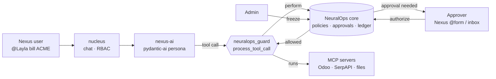

# NeuralOps Gate for NeuralOps Nexus — Proposal & Test Guide

Sep 28, 2026 · Zee · [github.com/z-sops/neuralops](https://github.com/z-sops/neuralops) · Apache-2.0

## TL;DR

Nexus is where people, personas and agents work together. This project was built to be the layer underneath it: **the rulebook and the record**.

- **Before a persona acts on a real system** (an Odoo write, an email, a payment, a deploy), NeuralOps decides: run now, wait for a named human's approval, or refuse because the workspace is frozen.
- **Every step is recorded** in an HMAC-signed, hash-chained ledger that replays into the same state, so the audit trail can be checked.
- **It plugs into Nexus the way Nexus already works.** `nexus-ai` runs pydantic-ai, so a guard hooks into `process_tool_call`. NeuralOps also serves its own tools over streamable-HTTP MCP, the transport Nexus uses by default.

It covers items on the Nexus roadmap that are not built yet: multi-agent coordination (the MVP is in development), and audit logs and advanced roles (Enterprise, coming soon).

**The ask:** run it next to one Nexus deployment for a week, wire the guard into `nexus-ai`, and decide together whether it belongs inside Nexus.

- Repo: [github.com/z-sops/neuralops](https://github.com/z-sops/neuralops) (public, `main` = V0.1.5)
- Nexus setup guide: [`integrations/nexus/README.md`](../mini-services/neuralops-mcp/integrations/nexus/README.md)

## What Nexus has, and what this adds

| Nexus today | Gap | NeuralOps Gate |
| --- | --- | --- |
| Personas act through MCP tools on real systems | Nothing between "the model decided" and "the tool ran" | `perform`: each tool call is checked first; governed actions wait for a single-use human approval |
| RBAC (Owner/Admin/Member/Viewer) for workspace access | Access is not the same as permission to *act* | Policies per action and scope (`odoo.write/production → Noaman`), approver chain, veto, no self-approval |
| "Advanced roles & audit logs" on the Enterprise roadmap | No audit trail yet | Signed, replayable ledger of who requested, approved and ran what (`/api/ledger`, `/api/integrity`) |
| "Multi-agent system" in the MVP | Coordination between agents is still being built | Tasks, claims, handoffs, decisions, evidence and compact task context as typed acts |
| Agents run autonomously | No emergency stop | Kill switch: one admin call freezes every persona, agent, gate and hook |
| Prompt text moves between agents | Injection risk when one agent's output becomes another's input | Agent-written text (including tool arguments shown to approvers) is flattened and flagged as data |

## How it plugs in



1. The persona decides to call `create_invoice`.
2. The guard (inside `nexus-ai`) sends `perform {action: "odoo.write", target: "create_invoice", detail: <args>}` using the persona's own token.
3. If the persona has direct authority, or no policy covers the action, the call is allowed. Either way it is logged.
4. If a policy covers it, an approval is created for the named person with the exact arguments. The tool does **not** run, and the model is told: "needs approval_0007 from agent.noaman". The person approves with their own token (`POST /api/acts` `authorize` — for example from a Nexus `@form` button), and the next attempt runs. Each approval works once.
5. If the workspace is frozen, nothing runs.

The core is one Bun + TypeScript process with a REST API, a WebSocket stream and MCP. It talks to Nexus only over the network, so the two codebases and their licenses stay separate. Apache-2.0 code can also be moved into the AGPL Nexus repo if that turns out to be the better home.

## What exists today (V0.1.5)

Everything below is in the repo and covered by 148 automated tests.

| Area | Feature | What it does |
| --- | --- | --- |
| Tool calls | `perform` act | Check before running; allowed via authority, via "ungoverned", or via a consumed approval; otherwise an approval is created with the call's details |
| Tool calls | Python guard | `neuralops_guard.py`: pydantic-ai `process_tool_call` hook plus a decorator for plain tools; standard library only; fails closed if the core is down |
| Tool calls | Kill switch | `POST /api/admin/freeze` / `unfreeze`; journaled, survives restarts, shown as a banner on the dashboard |
| Setup | Policy presets | `nexus-default` (Odoo/DB writes, email, payments, deletes, deploys need a human) plus `solo-dev`, `two-agent-team`, `production-gated`, `lockdown`; one call with the approver's name |
| People | Approval webhook | `approval.requested` / `approval.decided` / `workspace.frozen` POSTed to Nexus (or Slack), HMAC-signed; ideal for an `@form` in the approver's chat |
| People | Approval reasons | The approver can say why; the reason is on the approval and in the ledger |
| Audit | Auditor identities | Read-only tokens for a client's auditor: ledger, integrity proof, approvals, policies; can never act |
| Interfaces | MCP over HTTP | `POST /mcp` (streamable HTTP, stateless), one bearer token per persona; optional token-in-URL for hosts that can't send headers |
| Interfaces | MCP over stdio | For Claude Code, Codex CLI and Gemini CLI |
| Interfaces | REST + WebSocket | Inbox, approvals, ledger, live `ledger:event` stream |
| Interfaces | Protocol Inspector | Dashboard: workforce, tasks, approvals with details, reservations, live ledger |
| Authority | Policies, approver chain, veto | Approvers per action and scope; managers up the chain can approve; `deny` authority can veto; a requester never approves itself |
| Authority | Single-use approvals | Bound to requester, action, scope and task; consumed by the act they unlock |
| Coordination | 26 typed acts | Tasks, handoffs, decisions, evidence, questions and proposals with TTL, approvals, escalation, file reservations, `perform` |
| Coordination | Compact task context | Objective, decisions, constraints, evidence and open items for whoever picks up the work (about 70–80% smaller than the full record) |
| Evidence | Verified evidence | Only an `attest` identity (CI) produces VERIFIED evidence; gates can require it and no approval skips it |
| Integrity | Signed journal + ledger | HMAC-chained journal with a signed head; tampering stops the server; restart replays into identical state |
| Security | Secure mode | Per-identity tokens with expiry, revoke and rotate; admin API; rate limiting; loopback-only unless secure mode |
| Code agents | Hooks, pre-commit, CI | The same rules in Claude Code, Codex CLI and Gemini CLI hooks, a git pre-commit hook, and a GitHub required check |

## Try it with Nexus (about 45 minutes)

**1. Run and verify the core (5 min)**

```bash
git clone https://github.com/z-sops/neuralops.git
cd neuralops/mini-services/neuralops-mcp
bun install
bun test        # expect: 148 pass, 0 fail (needs python3 for the guard test)
```

**2. Start it where `nexus-ai` can reach it (5 min).** Calls come from inside the `nexus-ai` container, so bind to the host IP. That requires secure mode:

```bash
NEURALOPS_MODE=secure NEURALOPS_HOST=0.0.0.0 \
NEURALOPS_ADMIN_TOKEN=$(openssl rand -hex 24) NEURALOPS_JOURNAL_KEY=$(openssl rand -hex 32) \
bun src/index.ts
```

**3. Register one approver and one persona, and set the rulebook (5 min).** The commands are in the [setup guide](../mini-services/neuralops-mcp/integrations/nexus/README.md). One call sets sensible policies: `POST /api/presets/nexus-default/apply {"approver":"agent.<you>"}`. Add `NEURALOPS_WEBHOOK_URL` to be pinged when an approval is waiting.

**4. Add the guard to `nexus-ai` (15 min).** Copy `neuralops_guard.py` into `nexus-ai` and pass `process_tool_call=guard.process_tool_call` wherever the persona's MCP toolsets are built. Use the persona's NeuralOps token.

**5. Run the scenario (15 min)**

1. `@Layla` does something ungoverned (a web search) → it runs, and the call shows up in `GET /api/ledger`.
2. `@Layla` does something governed (an Odoo write) → the tool does not run, and Layla says it is waiting for approval from you.
3. Approve it with the approver's token (`POST /api/acts` `{"type":"authorize","payload":{"approvalId":…}}`) → ask again → it runs once. Ask a third time → it needs a new approval.
4. `POST /api/admin/freeze` → every tool call is refused → `unfreeze`.
5. `GET /api/integrity` → `chainValid` and `replayMatches` are both `true`.

Optionally, register NeuralOps itself as an MCP server in Nexus (`http://<host-ip>:3031/mcp`, streamable-http, `Authorization: Bearer <persona token>`) so personas can use the inbox, tasks and handoffs.

## Also for coding agents

If Nexus users also run coding agents in a repo, the same core applies the same rules there:

| Actor | How it is enforced | Config |
| --- | --- | --- |
| Claude Code | `PreToolUse` hook (Edit/Write/MultiEdit/NotebookEdit, Bash) | `integrations/claude-code/settings.example.json` |
| Codex CLI | `PreToolUse` hook (`apply_patch`, Bash) | `integrations/codex/config.toml` |
| Gemini CLI | `BeforeTool` hook (`write_file`, `replace`, `run_shell_command`) | `integrations/gemini/settings.json` |
| Anyone using git | pre-commit hook: no commits to files another agent has reserved | `bun run install-git-hook` |
| Everyone | GitHub required check: no merge until the task is cleared | `integrations/github/neuralops-gate.yml` |

The rules: no edits without a claimed task; no edits to files someone else has reserved; no push to `main` before clearance; no deploy without approval. Local hooks can be removed and `--no-verify` skips git hooks, so the CI check is the final line.

## Where it stands against other tools

| Capability | NeuralOps | [MCP Agent Mail](https://github.com/Dicklesworthstone/mcp_agent_mail) | [Claude Code Agent Teams](https://www.developersdigest.tech/blog/claude-code-agent-teams-subagents-2026) |
| --- | --- | --- | --- |
| Gate a tool call on a human approval | Yes, single-use, never self-approved | Human "overseer" messages | Not mentioned |
| Kill switch | Yes | Not mentioned | Not mentioned |
| Tamper-evident audit | Signed journal, hash chain, replay check | Git history; optional signed exports | Not mentioned |
| Verified evidence (CI, not the agent's claim) | Yes | Not mentioned | Not mentioned |
| Messaging and search | Typed questions and proposals only | Rich threads, full-text and semantic search | Yes |
| Maturity | V0.1.5, no outside users yet | About 2.1k GitHub stars | Built into Claude Code |

"Not mentioned" means we did not find it in their public README or site on 28 Sep 2026.

Positioning: Agent Mail helps agents talk; NeuralOps controls what agents can do. Inside Nexus, chat, knowledge and personas stay with Nexus, and NeuralOps adds the permission and the proof.

## Decisions to make together

| Question | Options |
| --- | --- |
| Name | "NeuralOps Gate" as a Nexus module, or a separate name |
| Where the code lives | A separate service next to Nexus (as today), or moved into the Nexus repo (Apache-2.0 allows either) |
| Approvals UI | Nexus `@form` in chat, a Nexus approvals page, or the NeuralOps dashboard |
| Identities | Register Nexus users once (today), or map Supabase users automatically |
| Which actions are governed | Start with writes to external systems (Odoo, email, payments), or everything (`*`/`*` policy) and loosen from there |

## Status and limits

**Verified today:** 148 automated tests. They cover the protocol, authority, replay and tamper detection, HTTP and WebSocket, MCP over stdio and streamable HTTP with a real MCP SDK client, file reservations, the kill switch, the Claude/Codex/Gemini hooks run as real processes, and the Python guard run against a live core, including a real pydantic-ai agent whose tool must not run before approval. TypeScript and lint are clean.

**Known limits**

- Not yet run inside a real Nexus deployment. The integration points come from the Nexus README (`nexus-ai` on pydantic-ai, MCP servers registered by URL, streamable-http by default).
- One process, one workspace, and a JSONL journal: no multi-instance setup yet.
- Approvals are single-use. An action repeated many times needs an approval each time; batch or time-boxed approvals are the obvious next step.
- Nexus users are not mapped automatically, and identity ids use the `agent.<name>` format, for people too.
- Prompt-injection flagging is a heuristic: it marks likely instructions but cannot catch every attack.

**Next:** hook blocks and human feedback in the ledger, a trust-metrics page, a policy simulator, budget gates fed by LiteLLM cost data, time-boxed and batch approvals, automatic Nexus user mapping, a database-backed journal, and multi-workspace (one per Nexus workspace).

## Feedback we need

1. Did the guard fit into `nexus-ai` where we expected, and how long did it take?
2. Which actions did you actually want gated, and was approving them a help or a chore?
3. Where should approvals live in Nexus: chat `@form`, a page, or somewhere else?
4. Would you use the ledger as the Nexus audit log?
5. Keep it separate, or merge it into Nexus? What would change your answer?

Send feedback as [GitHub issues](https://github.com/z-sops/neuralops/issues) or directly to Zee.

## Sources

- [NeuralOps repository](https://github.com/z-sops/neuralops)
- [NeuralOps Nexus repository](https://github.com/mapax-io/neuralops-nexus)
- [MCP Agent Mail on GitHub](https://github.com/Dicklesworthstone/mcp_agent_mail)
- [Claude Code Agent Teams, Subagents, and MCP: the 2026 playbook](https://www.developersdigest.tech/blog/claude-code-agent-teams-subagents-2026)
- [Gemini CLI hooks reference](https://geminicli.com/docs/hooks/reference/)
- [Codex CLI hooks reference](https://agenticcontrolplane.com/blog/codex-cli-hooks-reference)
