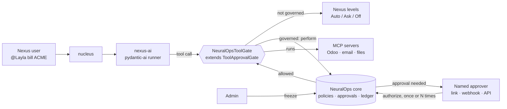

# NeuralOps for NeuralOps Nexus — Proposal & Test Guide

Sep 28, 2026 · Zee · [github.com/z-sops/neuralops](https://github.com/z-sops/neuralops) · Apache-2.0

## TL;DR

Nexus already has the right instinct: every persona tool runs at a level (Auto, Ask or Off), and an Ask tool waits until a person in the topic decides. NeuralOps plugs into exactly that mechanism, as a subclass of Nexus' own `ToolApprovalGate`, and adds four things a team needs once personas act on real systems:

1. **The right person approves.** Policies name the approver per action (`odoo.write/production → Noaman`), with an approver chain, veto and no self-approval. A governed action waits for that person even if the tool is set to Auto.
2. **Unattended runs can act safely.** Schedules and swarms refuse every Ask tool today. With NeuralOps an approver grants a *standing approval* ("Layla may `odoo.write` 20 times today") and the unattended run uses it; otherwise it leaves a request and moves on.
3. **A record you can prove.** Every acting call, approval (with its reason), refusal and block goes into an HMAC-signed, hash-chained ledger that replays into the same state. A client's auditor gets a read-only token.
4. **One kill switch** stops every persona's tools at once.

Everything NeuralOps does not govern keeps Nexus' levels and topic decisions exactly as they are. The integration is a patch to `nexus-ai` that is off unless `NEURALOPS_URL` is set, and it passes Nexus' own test suite.

**The ask:** apply the patch on one Nexus deployment for a week, govern two or three real actions, and tell us whether it belongs in Nexus.

- Repo: [github.com/z-sops/neuralops](https://github.com/z-sops/neuralops) (public, `main` = V0.1.6)
- Nexus guide and patch: [integrations/nexus](https://github.com/z-sops/neuralops/tree/main/mini-services/neuralops-mcp/integrations/nexus)

## What Nexus has, and what this adds

Based on the Nexus source (`mapax-io/neuralops-nexus` @ `939af00`, server 0.8.0).

| Nexus today | What is still open | NeuralOps adds |
| --- | --- | --- |
| Tool levels Auto / Ask / Off per persona; Ask waits for someone in the topic; "always allow" for the rest of a run | Anyone in the topic with the right can decide; there is no rule for *who* approves *what* | Policies with a named approver per action and scope, approver chain, veto, no self-approval, and one-click links for the approver |
| Schedules and swarms refuse every Ask tool ("nobody can give one") | Unattended work cannot do anything that needs approval | Standing approvals: N uses, time-boxed, granted in advance by someone entitled to approve |
| The decision is stored on the reply row in nucleus | No tamper-evident trail across personas and runs | Signed, replayable ledger of calls, approvals (with reasons), refusals and blocks; read-only auditor identities |
| Spend limits per persona | No emergency stop across personas | Kill switch: freeze every persona's tools with one call; journaled, survives restarts |
| The LiteLLM runner is not wired to tool approvals (Nexus open item) | Same | Same (the integration targets the pydantic-ai runner, like Nexus' own approvals) |

## How it plugs in



1. The worker holds one NeuralOps **broker** token. It acts as each persona (`agent.persona-<id>`, created on first use and delegated to the worker) and cannot act as itself or anyone else.
2. For each tool call the gate asks the core (a dry run that records nothing): frozen? governed? authority? usable approval?
3. **Frozen** → the call is skipped and the model is told why.
4. **Governed** → `perform`: runs if the persona holds authority or a usable approval; otherwise an approval is created for the named approver with the call's arguments. Interactive runs wait for the decision (the approver gets a webhook and a one-click link); unattended runs leave the request and move on. A denial reaches the model with the approver's reason.
5. **Not governed** → Nexus' own level and topic decision, as today; acting calls and topic denials are recorded in the ledger.

The core is one Bun + TypeScript process with a REST API, WebSocket and MCP (stdio and streamable HTTP). NeuralOps is Apache-2.0, so its files can live inside the Nexus repo under Nexus' license terms or stay a separate service.

## What exists today (V0.1.6)

Everything below is in the repo and covered by automated tests (159 in NeuralOps, plus 9 new tests inside Nexus' suite).

| Area | Feature | What it does |
| --- | --- | --- |
| Nexus | `NeuralOpsToolGate` + patch | Subclass of Nexus' `ToolApprovalGate`; off unless `NEURALOPS_URL` is set; Nexus' own tests still pass |
| Nexus | Broker identity | The worker acts for personas it is the delegate of, never as itself; personas are created on first use |
| Nexus | Sign in with Supabase | A Supabase access token (JWKS or legacy HS256) works as the person's NeuralOps identity; optional auto-provisioning |
| Approvals | Named approver, chain, veto | Policies per action and scope; managers up the chain can approve; `deny` authority vetoes; never self-approved |
| Approvals | Multi-use, time-boxed, standing | `authorize {uses, validForSeconds, reason}`; `grant_approval` in advance for unattended runs |
| Approvals | One-click links | Signed, expiring, single-decision link per approval and approver; GET never decides; recorded as the approver via "link" |
| Approvals | Webhook | `approval.requested` / `approval.decided` / `workspace.frozen`, HMAC-signed, several receivers, retries, delivery log |
| Setup | Policy presets | `nexus-default`, `solo-dev`, `two-agent-team`, `production-gated`, `lockdown`, plus your own (journaled) |
| Control | Kill switch | Freeze / unfreeze; blocks acts, gates, the Nexus gate, hooks and pre-commit |
| Record | Signed ledger | HMAC-chained journal, hash-chained ledger, replay check (`/api/integrity`); enforcer blocks recorded too |
| Access | Read scopes and auditors | Secure mode default: identities read only what they are part of; audit tokens read the ledger and never act |
| Code agents | Hooks, pre-commit, CI | The same rules in Claude Code, Codex CLI and Gemini CLI hooks, a git pre-commit hook and a GitHub required check |

## Try it with Nexus (about 45 minutes)

**1. Verify the core (5 min)**

```bash
git clone https://github.com/z-sops/neuralops.git
cd neuralops/mini-services/neuralops-mcp
bun install && bun test       # expect: 0 fail
```

**2. Start it on the host IP in secure mode, create the worker's broker identity, one approver and the `nexus-default` rulebook (10 min).** Commands: [Nexus guide, steps 1–2](https://github.com/z-sops/neuralops/blob/main/mini-services/neuralops-mcp/integrations/nexus/README.md).

**3. Apply the patch to Nexus and set three variables (10 min).**

```bash
cd neuralops-nexus
git apply /path/to/neuralops/mini-services/neuralops-mcp/integrations/nexus/nexus-ai.patch
# nexus-ai env: NEURALOPS_URL, NEURALOPS_TOKEN (worker broker token), NEURALOPS_ACTIONS (tool → action map)
```

**4. Run the scenario (20 min)**

1. `@Layla` searches the web → runs as before (ungoverned, Auto).
2. `@Layla` runs a shell command → Nexus asks in the topic as before; the call now also appears in `GET /api/ledger`.
3. `@Layla` creates an Odoo invoice → does not run; the approver gets a webhook with a link; they approve with a reason → it runs once.
4. Grant a standing approval, then trigger a scheduled run that writes to Odoo → it runs without anyone watching; the next call beyond the grant leaves a request.
5. `POST /api/admin/freeze` → every persona's tools stop → `unfreeze`.
6. `GET /api/integrity` → `chainValid` and `replayMatches` are `true`.

## Where it stands against other tools

| Capability | NeuralOps | [MCP Agent Mail](https://github.com/Dicklesworthstone/mcp_agent_mail) | [Claude Code Agent Teams](https://www.developersdigest.tech/blog/claude-code-agent-teams-subagents-2026) |
| --- | --- | --- | --- |
| Named approver per action, never self-approved | Yes | Human "overseer" messages | Not mentioned |
| Standing approvals for unattended runs | Yes | Not mentioned | Not mentioned |
| Kill switch | Yes | Not mentioned | Not mentioned |
| Tamper-evident audit | Signed journal, hash chain, replay check | Git history; optional signed exports | Not mentioned |
| Messaging and search | Typed questions and proposals only | Rich threads, full-text and semantic search | Yes |
| Maturity | V0.1.6, no outside users yet | About 2.1k GitHub stars | Built into Claude Code |

"Not mentioned" means we did not find it in their public README or site on 28 Sep 2026. Positioning: chat, knowledge, personas and topic approvals stay with Nexus; NeuralOps adds who-may-approve-what, unattended approvals, the proof and the off switch.

## Decisions to make together

| Question | Options |
| --- | --- |
| Name | A Nexus module name (e.g. "Nexus Governance"), or keep NeuralOps separate |
| Where the code lives | Patch files inside `nexus-ai` + NeuralOps core as a service (today), or the core inside the Nexus stack (compose service) |
| Where approvals show | NeuralOps link page (today), a card in the topic, or a Nexus approvals screen using the person's Supabase token |
| Which actions are governed | Start with `nexus-default` (writes, email, payments, deletes, deploys) or `lockdown` and loosen |
| Topic "always allow" vs policies | Should a governed action ever accept the topic's "always allow"? (today: no, the named approver decides) |

## Status and limits

**Verified today:** 159 automated tests in NeuralOps (protocol, authority, approvals incl. multi-use and standing, links, webhook delivery, JWT identities with HS256 and ES256, read scopes, replay and tamper detection, MCP stdio and HTTP, hooks as real processes, a real pydantic-ai agent), 9 new tests inside Nexus' own suite, and a live test of Nexus' real gate with NeuralOps against a running core. TypeScript and lint are clean.

**Known limits**

- Tested at the Nexus worker level, not yet in a full Nexus deployment (web app, nucleus, relay).
- While a governed call waits, the topic shows the run as working rather than a "waiting for Noaman" card; the webhook and link carry that message.
- One process and a JSONL journal; no multi-instance setup yet.
- Prompt-injection flagging of agent-written text is a heuristic.

**Next:** a "waiting for approval" card in the Nexus topic, hook-block feedback and a trust-metrics page, a policy simulator, then a database-backed journal, snapshots and a load benchmark.

## Feedback we need

1. Did the patch apply and run on your deployment, and how long did it take?
2. Which actions did you govern, and did the named-approver flow help or get in the way?
3. Did standing approvals make scheduled or swarm runs useful?
4. Would you use the ledger as the Nexus audit log?
5. Separate service or part of Nexus — what would change your answer?

Send feedback as [GitHub issues](https://github.com/z-sops/neuralops/issues) or directly to Zee.

## Sources

- [NeuralOps repository](https://github.com/z-sops/neuralops)
- [NeuralOps Nexus repository](https://github.com/mapax-io/neuralops-nexus) (`modules/nexus-ai/apps/managers/approvals.py`, `docs/OPEN-ITEMS.md`)
- [MCP Agent Mail on GitHub](https://github.com/Dicklesworthstone/mcp_agent_mail)
- [Claude Code Agent Teams, Subagents, and MCP: the 2026 playbook](https://www.developersdigest.tech/blog/claude-code-agent-teams-subagents-2026)
