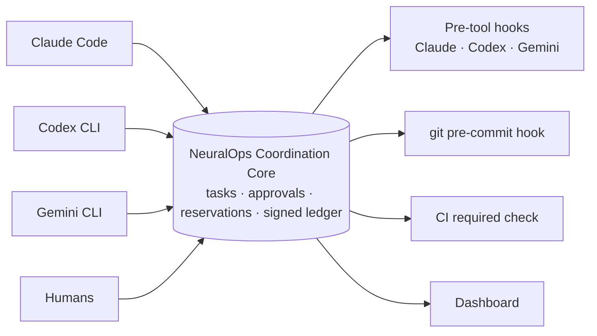

# NeuralOps MCP — Pitch & Test Guide

Sep 28, 2026 · Zee · [github.com/z-sops/neuralops](https://github.com/z-sops/neuralops)

## TL;DR

NeuralOps is a control layer for AI coding agents: it decides who works on what, which files they may touch, and what they may ship, and it records every step in a signed audit ledger. Agents (Claude Code, Codex CLI, Gemini CLI) connect over MCP; humans stay the approvers.

- **Coordination:** tasks, handoffs, decisions and evidence as typed acts instead of chat, with compact task context for the next agent.
- **Control:** approvals an agent can never grant itself, file reservations, and gates that CI, git and Claude Code hooks enforce outside the model.
- **Proof:** an HMAC-signed, replayable ledger of who did, decided and approved what.

**Why you:** your product is a joint workspace for humans and AI. NeuralOps is the missing rulebook for that workspace — agents do the work, humans approve what matters, and nobody (human or agent) can quietly skip a step.

**The ask:** run it for a week on one real repo with at least two agents, and tell us where it helped, where it got in the way, and whether it belongs inside your product.

- Repo: [github.com/z-sops/neuralops](https://github.com/z-sops/neuralops) (public, `main` = V0.1.3)
- Clone: `git clone https://github.com/z-sops/neuralops.git`
- Setup takes about 15 minutes (section *Try it*).

## The problem

One agent in a repo is manageable; two or more agents plus a human quickly turn into a coordination and trust problem.

| What goes wrong | Example |
| --- | --- |
| Two agents edit the same files | Claude refactors `src/auth/` while Codex adds a feature there; one overwrites the other |
| Decisions get lost between sessions | The architect chose sessions over JWT; three hours later a new agent writes JWT code |
| The human becomes the messenger | You copy context, decisions and constraints from one agent's chat into another's |
| "Tests pass" is just a claim | An agent reports green tests that never ran; nothing checks it |
| Nobody asks before production | An agent merges or deploys because nothing in its path said no |
| No trustworthy record | A week later, nobody can say who approved a change or why |

Chat-based coordination does not fix this: messages are not state, and a rule an agent can read is a rule it can ignore.

## How it works

Every agent talks to one Coordination Core; the core owns the truth, and enforcement points ask it before anything risky happens.



The core decides; the hooks and CI only ask it, so an agent cannot talk its way past a rule.

**The core loop for an agent:**

1. `neuralops_inbox` — what is waiting on me (tasks, handoffs, approvals, questions)?
2. `neuralops_claim` a task, then `neuralops_reserve_files` for the files it will change.
3. `neuralops_get_task_context` — a compact snapshot (objective, decisions, constraints, evidence, open items) instead of another agent's full chat.
4. Work; record `decision` and `evidence` acts as it goes.
5. `neuralops_complete` — if the task is gated, this returns an approval request instead of completing; a human (or the named approver) authorizes it; the agent calls complete again.
6. Merge: CI asks `gate_status`; only a completed, cleared task passes.

**Where state lives:** one process (Bun + TypeScript) on the developer's machine, loopback-only by default. Every accepted act goes into an HMAC-signed journal; on restart the journal is replayed into exactly the same state.

## Features (V0.1.3)

Everything below is implemented, in the repo, and covered by the 127-test suite.

| Area | Feature | What it does |
| --- | --- | --- |
| Protocol | 25 typed acts in 6 families | Task (create, claim, release, complete, block, status, reserve/release files), handoff, information (evidence, decision, update), conversation (question, answer, proposal, counter), authority (request approval, authorize, deny, escalate), lifecycle |
| Protocol | Validation and atomicity | Every payload has a schema; a rejected act changes nothing; client act ids work as idempotency keys |
| Protocol | Conversations expire | Questions and proposals carry a TTL (default 1 hour) unless something durable comes out of them |
| Authority | Policies, gates, approver chain | Workspace policies name approvers; tasks carry gates (for example `complete/production`); a manager up the chain can approve |
| Authority | Separation of duties | The requester can never approve its own request; approvals are single-use and bound to one task |
| Authority | Veto | An agent with `deny` authority (for example Security) can block a production approval but not grant one |
| Evidence | Verified evidence | Evidence from an agent with `attest` authority (the CI agent) is VERIFIED; gates can require it, and no approval skips that |
| Files | File reservations | Exclusive or shared claims on globs, TTL and renew, conservative overlap check, force-release by a manager |
| Files | Reservations follow the task | Released on complete or release, moved to the new owner on handoff, released when an agent is revoked |
| Context | Compact task context | Objective, completed, decisions, constraints, evidence, open items, next steps, gates, reserved files; about 70–80% smaller than the full record (character-based estimate) |
| Context | Inbox | One call shows my tasks, handoffs to accept, approvals to decide, questions, my reservations |
| Context | Prompt-injection guard | Other agents' text is shown as flattened, flagged data, with a notice that it is never an instruction |
| Integrity | Signed journal | Every record is HMAC-chained with a signed head; edits, deletions and truncation stop the server from starting |
| Integrity | Hash-chained ledger + replay | Restart replays the journal into identical state; `/api/integrity` proves it |
| Security | Tokens | Per-agent bearer tokens with expiry, revoke and rotate; only hashes are stored |
| Security | Secure mode | Admin token for admin actions, loopback-only by default, rate limiting, gateway locked to the core |
| Admin | Admin API | Register agents, set policies and authority; every admin change is audited and replayable |
| Enforcement | Claude Code PreToolUse hook | Blocks edits without a claimed task or on files someone else reserved, push to main before clearance, deploys without approval |
| Enforcement | git pre-commit hook | Blocks commits of files reserved by another agent, for any tool that commits through git |
| Enforcement | CI required check | GitHub workflow: records CI test results as verified evidence, then blocks the merge until the task is cleared |
| Interfaces | Real MCP server | 38 tools over stdio (`@modelcontextprotocol/sdk`); also a REST API and WebSocket stream |
| Interfaces | Protocol Inspector | Next.js dashboard: workforce, tasks, approvals, file reservations, compact context, live ledger |

## Enforcement per agent

Claude Code, Codex CLI and Gemini CLI all run the same NeuralOps pre-tool hook; git pre-commit and a CI required check cover everyone else, including humans.

All three CLIs now support hooks that run before a tool call and block it on exit code 2 ([Gemini CLI hooks reference](https://geminicli.com/docs/hooks/reference/), [Codex hooks](https://agenticcontrolplane.com/blog/codex-cli-hooks-reference)). One implementation handles each CLI's tool names:

| Actor | How it is enforced | Edit tools checked | Shell tool checked | Config in the repo |
| --- | --- | --- | --- | --- |
| Claude Code | `PreToolUse` hook | Edit, Write, MultiEdit, NotebookEdit | Bash | [claude-code/settings.example.json](https://github.com/z-sops/neuralops/blob/main/mini-services/neuralops-mcp/integrations/claude-code/settings.example.json) |
| Codex CLI | `PreToolUse` hook | `apply_patch` (every file named in the patch) | Bash | [codex/config.toml](https://github.com/z-sops/neuralops/blob/main/mini-services/neuralops-mcp/integrations/codex/config.toml) |
| Gemini CLI | `BeforeTool` hook | `write_file`, `replace` | `run_shell_command` | [gemini/settings.json](https://github.com/z-sops/neuralops/blob/main/mini-services/neuralops-mcp/integrations/gemini/settings.json) |
| Any git user (other tools, humans) | git pre-commit hook | commits of reserved files | — | `bun run install-git-hook -- --repo <worktree> --token <token>` |
| Everyone | GitHub required status check | merge to `main` | — | [github/neuralops-gate.yml](https://github.com/z-sops/neuralops/blob/main/mini-services/neuralops-mcp/integrations/github/neuralops-gate.yml) |

**Rules the hooks apply (same for all three CLIs):**

- Editing a file needs a claimed, in-progress task.
- Editing a file another agent reserved exclusively is blocked, with the holder named; `NEURALOPS_REQUIRE_RESERVATION=1` also blocks unreserved files.
- `git push` to `main` needs the task completed and its gate cleared; a feature-branch push needs a claimed task.
- Deploy and publish commands (`vercel --prod`, `npm publish`, `fly deploy`, `kubectl apply`, `terraform apply` and similar) need an approved `deploy/production` gate.
- If the core is unreachable, edits pass with a warning (`NEURALOPS_HOOK_STRICT=1` blocks them); push and deploy always fail closed.

**Why CI is still the last line:** a local hook can be removed and `git commit --no-verify` skips git hooks. The GitHub check runs where the agent cannot reach, so an unapproved or unverified change cannot merge. It also records CI test results as VERIFIED evidence, which gates can require.

**Tested:** each CLI's hook is spawned as a real process in the test suite with that CLI's payload shape (edit of a reserved file, push to main, deploy); a real git repo is used for the pre-commit test. Codex asks you to trust a hook before it runs, and some Codex versions need `[features] hooks = true`.

## Competitors: where we are strong, where we are behind

NeuralOps wins on control (approvals, verified evidence, CI gating, enforcement in three CLIs); MCP Agent Mail wins on messaging, search and maturity.

| Capability | NeuralOps | [MCP Agent Mail](https://github.com/Dicklesworthstone/mcp_agent_mail) | [multiagents](https://github.com/qanh10x10/multiagents) | [Claude Code Agent Teams](https://www.developersdigest.tech/blog/claude-code-agent-teams-subagents-2026) |
| --- | --- | --- | --- | --- |
| Works across Claude, Codex, Gemini | Yes, over MCP | Yes, tested with 40–50 agents | Yes | Claude Code only |
| Messaging between agents | Typed questions and proposals with TTL only (by design) | Rich threads, CC/BCC, acknowledgements | Yes | Yes |
| Search over history | No | Full-text and semantic | Not mentioned | Not mentioned |
| File reservations | Yes: enforced in Claude, Codex and Gemini hooks, git pre-commit, and follows the task on handoff | Yes: advisory, optional pre-commit guard | Exclusive locks, ownership zones | Not mentioned |
| Approval before complete or deploy | Yes: policies, approver chain, veto, single-use, never self-approved | Human "overseer" priority messages; contact approvals | Review workflow with approve state | Not mentioned |
| CI merge gate | Yes: GitHub required check | Not mentioned | Not mentioned | Not mentioned |
| Verified evidence (CI, not the agent's claim) | Yes | Not mentioned | Not mentioned | Not mentioned |
| Tamper-evident audit | HMAC-signed journal, hash-chained ledger, replay check | Git history; optional Ed25519-signed exports | Not mentioned | Not mentioned |
| Prompt-injection guard on agent text | Yes | Not mentioned | Not mentioned | Not mentioned |
| Maturity | V0.1.3, 127 tests, no outside users yet | About 2.1k GitHub stars, stress-tested | Early (0 stars) | Built into Claude Code |

"Not mentioned" means we did not find it in their public README or site on 28 Sep 2026, not that it cannot exist.

**Where NeuralOps is strong**

- The only one here that gates *what ships*: completion, merge and deploy need an approval the agent cannot grant itself.
- Proof instead of claims: gates can require test evidence recorded by CI, and no approval skips that.
- The same rules in Claude Code, Codex CLI and Gemini CLI, plus git and CI for everyone else.
- A signed, replayable record of who decided and approved what.

**Where NeuralOps is behind**

- Messaging and search: Agent Mail's threads and semantic search are far richer.
- Maturity: Agent Mail has thousands of users; NeuralOps has none outside its author yet.
- Scale: single process, JSONL journal; not load-tested with dozens of agents.

**Positioning:** Agent Mail helps agents talk to each other; NeuralOps controls what agents can ship. They can run side by side.

Not competitors: [Nylas Agent Accounts](https://www.nylas.com/products/agent-accounts/) and [AgentMail](https://www.agentmail.to/blog/best-email-api-for-ai-agents-2026) give agents real email inboxes (outreach, scheduling). Their controls are send quotas, allowlists and drafts, not task ownership or approvals — a possible later integration, not a rival.

## Try it

Clone, run three processes, open `http://localhost:81`; about 15 minutes to a working dashboard and 30 more to a real two-agent test.

**Repo:** <https://github.com/z-sops/neuralops> · branch `main` · needs [Bun](https://bun.sh), [Caddy](https://caddyserver.com/download) and git.

### 1. Run it (demo mode, this machine only)

```bash
git clone https://github.com/z-sops/neuralops.git
cd neuralops/mini-services/neuralops-mcp
bun install
bun test                 # expect: 127 pass, 0 fail
bun run dev              # core on 127.0.0.1:3031
```

In a second terminal, from the repo root: `bun install` then `bun run dev:local` (dashboard on 127.0.0.1:3000). In a third: `caddy run --config Caddyfile` (Windows: `.\caddy.exe run --config Caddyfile`). Open `http://localhost:81` — not `:3000`, which shows DISCONNECTED because the dashboard reaches the core through the gateway.

Click through the Coordination Console top to bottom: the "authorize its OWN approval" and "QA → reserve auth files" scenarios are supposed to fail.

### 2. Connect a real agent

Demo mode seeds six agents with fixed tokens (`nops_demo_backend`, `nops_demo_architect`, …). Register your own instead:

```bash
curl -X POST http://127.0.0.1:3031/api/agents -H 'Content-Type: application/json' \
  -d '{"id":"agent.claude","name":"Claude","model":"Claude","role":"dev","reportsTo":"agent.architect"}'
# → returns a token, shown once

claude mcp add neuralops -e NEURALOPS_URL=http://127.0.0.1:3031 -e NEURALOPS_TOKEN=<token> \
  -- bun /abs/path/neuralops/mini-services/neuralops-mcp/src/mcp/stdio.ts
```

Then add the hook for that CLI (section *Enforcement per agent*) and the git hook: `bun run install-git-hook -- --repo <your worktree> --token <token> --url http://127.0.0.1:3031`.

### 3. A 30-minute test on your own repo

1. Make two worktrees of one repo: `git worktree add ../app-a -b task_1-a` and `../app-b -b task_2-b`; give each its own agent (for example Claude Code and Codex) with its own token and hooks.
2. Ask an agent to create tasks task\_1 and task\_2 with the neuralops\_create\_task tool (the dashboard has no create button yet); put a gate on one: `gates: [{action: "complete", scope: "production"}]`.
3. Agent A claims task\_1 and reserves `src/<module>/**`. Ask agent B to edit a file in that folder → its hook should block and name agent A.
4. Agent B tries to commit that file anyway from its worktree → the pre-commit hook should block.
5. Agent A finishes and calls complete → it gets an approval request; approve it in the dashboard's Pending Approvals; agent A completes again and its reservation is released.
6. Hand a task from A to B → B's context should arrive via `neuralops_get_task_context` without you pasting anything.
7. Check `http://127.0.0.1:3031/api/integrity` → `chainValid` and `replayMatches` should be true.

Optional: copy [neuralops-gate.yml](https://github.com/z-sops/neuralops/blob/main/mini-services/neuralops-mcp/integrations/github/neuralops-gate.yml) into a repo and make it a required check (needs the core reachable from CI: a self-hosted runner or secure mode behind HTTPS).

## Fit with a human + AI joint workspace

The cleanest fit: your product is where people and agents work; NeuralOps is the rulebook and the record underneath it, reached over REST, WebSocket and MCP.

| Idea | How, with what exists today |
| --- | --- |
| People as first-class members | Register each person as an agent with a role and a manager (`POST /api/agents`); they become approvers, task owners and handoff targets like any agent |
| Approval inbox inside your UI | `GET /api/inbox` for the signed-in person + `authorize` / `deny` acts; no need to open the NeuralOps dashboard |
| Live activity feed | Subscribe to the WebSocket `ledger:event` stream; every act arrives with who, what, task and a one-line summary |
| "Can this ship?" badge | `GET /api/gate/status?taskId=…` on any task card: completed, cleared, which approval, which evidence |
| Brief for whoever picks up work | `neuralops_get_task_context` gives a compact brief (objective, decisions, constraints, open items) for a human or an agent taking over |
| Who is editing what | `GET /api/reservations` shows which files are held, by whom, until when — a presence layer for code |
| Team policies | Admin API sets approvers per action and scope (for example: production deploys need the tech lead) |
| Audit export for clients | `/api/ledger` + `/api/integrity`: a signed history of who decided and approved what |

Not there yet, and worth building together if the fit is real: outgoing webhooks, multi-workspace (one per team or client), and SSO-backed identities for people.

## Status, limits, roadmap

V0.1.3 is a working, tested single-machine build that nobody outside its author has used yet — which is exactly why we want your test.

**Verified today:** 127 automated tests (protocol, authority, replay and tamper detection, HTTP and WebSocket, real MCP stdio, file reservations, and the Claude, Codex and Gemini hooks run as real processes); TypeScript and lint clean; the dashboard's scenarios checked in a real browser through Caddy.

**Known limits**

- Single workspace, single process; the journal is a JSONL file, so no multi-instance setup.
- Token counts for compaction are a characters-divided-by-4 estimate, not a real tokenizer.
- File-reservation overlap is deliberately conservative, so it can report a conflict that isn't one; paths are case-sensitive.
- Local hooks can be removed and `--no-verify` skips git hooks; only the CI required check is out of an agent's reach.
- Prompt-injection flagging is a heuristic: it marks likely instructions but cannot catch every attack.
- The demo tokens (`nops_demo_*`) are public; use secure mode with real tokens for anything beyond a local test.
- The repo has no license file yet; treat it as all rights reserved until one is added.

**Next**

| Version | Focus |
| --- | --- |
| V0.2 | Database-backed journal, multi-workspace, outgoing webhooks, a create-task and approvals UI in the dashboard |
| V0.3 | SSO identities for people, RBAC templates, cost and token tracking per agent and task |
| Later | Policy templates (HIPAA, SOC 2), hosted version, approvals for non-coding agent actions (email, payments) |

## Feedback we need

Five answers after a week of real use would tell us more than any feature we could add.

1. Did your agents follow the protocol (inbox → claim → reserve → context → complete) without reminders, or did you have to keep telling them?
2. How often did a hook block something, and was each block right or just in the way?
3. Did handoffs work from the compact context alone, or did you still paste things between agents?
4. Did NeuralOps catch a real problem: two agents on the same files, a merge without tests, a lost decision?
5. Would you put this inside your product, run it next to it, or not use it — and what would change your answer?

Send feedback as GitHub issues on [z-sops/neuralops](https://github.com/z-sops/neuralops/issues) (bugs, confusing steps) or straight to Zee (the product questions above).

## Sources

- [NeuralOps repository](https://github.com/z-sops/neuralops)
- [Gemini CLI hooks reference](https://geminicli.com/docs/hooks/reference/)
- [Codex CLI hooks reference (PreToolUse, apply\_patch, Bash)](https://agenticcontrolplane.com/blog/codex-cli-hooks-reference)
- [Codex advanced configuration (hooks in config.toml)](https://learn.chatgpt.com/docs/config-file/config-advanced)
- [MCP Agent Mail on GitHub](https://github.com/Dicklesworthstone/mcp_agent_mail)
- [MCP Agent Mail site](https://mcpagentmail.com/)
- [multiagents on GitHub](https://github.com/qanh10x10/multiagents)
- [Claude Code Agent Teams, Subagents, and MCP: the 2026 playbook](https://www.developersdigest.tech/blog/claude-code-agent-teams-subagents-2026)
- [Nylas Agent Accounts](https://www.nylas.com/products/agent-accounts/)
- [AgentMail: best email API for AI agents in 2026](https://www.agentmail.to/blog/best-email-api-for-ai-agents-2026)
